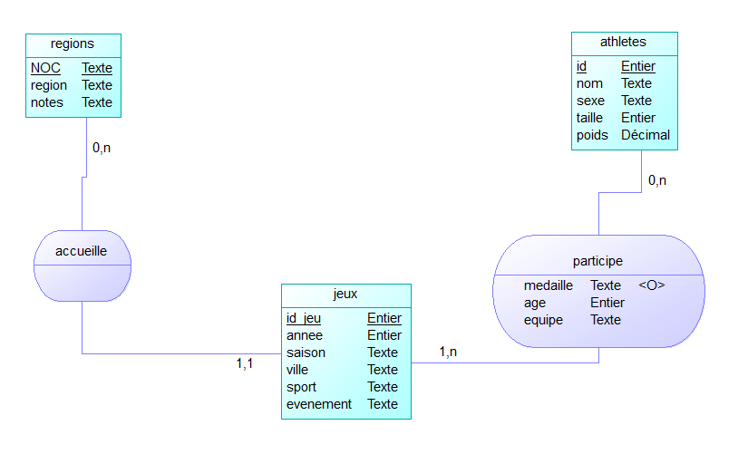
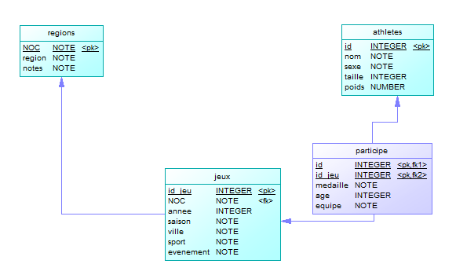

<div style="display:flex;flex-direction:column;justify-content:center;align-items:center;height:100vh;">
<h1 style="margin:0;">
  Rendu Saé 2.04
</h1>
<br />

</div>

<h2>La Team</h2>

- <manon.leclercq7.etu@univ-lille.fr> (Groupe S2-B)
- <thomas.gysemans.etu@univ-lille.fr> (Groupe S2-F, oui c'est autorisé par Mathieu)

<h2>Sommaire</h2>

- [Comprendre les données](#comprendre-les-données)
- [Ventilation](#ventilation)
  - [Informations complémentaires](#informations-complémentaires)
- [Requêtes sur le pays choisi](#requêtes-sur-le-pays-choisi)

Nous rédigeons un rapport, mais beaucoup de commentaires sont fournis dans le script SQL qui apportent des détails sur chacune des requêtes effectuées.

## Comprendre les données

On remarque que le retour à la ligne utilisé dans le fichier est `\r\n`. Il s'agit d'une aberration et nous devons donc remplacer ça :

```bash
cat fichier.csv | tr '\r\n' '\n' >fichier_correct.csv
```

1. Nombre de lignes :

```bash
wc -l noc_regions.csv
# 230
wc -l athlete_events.csv
# 271117
```

2. Afficher uniquement la première ligne du fichier :

```bash
cat fichier.csv | head -n 1
```

3. Le séparateur de champs :

C'est évidemment une virgule quand on regarde la première ligne.

4. Que représente une ligne ?

**Sur le fichier noc_regions.csv** :

Une ligne est un pays avec trois informations : son code unique à 3 lettres, le nom du pays puis une information optionnelle (qui par défaut est une chaîne vide) qui est un nom plus précis. C'est le cas pour le Yemen par exemple. Celui-ci a trois régions : le Yemen du Nord, le Yemen, et le Yemen du Sud (avec 3 codes différents).

**Sur le fichier athletes_events.csv** :

Une ligne est la participation d'un athlète à une épreuve avec beaucoup d'informations telles que l'âge de l'athlète, la médaille qu'il a gagnée ou non, le nom de l'épreuve, l'année des jeux etc.

5. Combien y a-t-il de colonnes ?

**Sur le fichier noc_regions.csv** : 3

**Sur le fichier athletes_events.csv** : 15

La commande : 

```bash
less fichier.csv | head -n 1 | tr ',' '\n' | wc -l
```

6. Quelle colonne distingue les jeux d'été de ceux d'hiver ?

On sait que cette information se trouve dans la colonne "Games". On veut savoir quel est le numéro de cette colonne.

```bash
cat athlete_events.csv | head -n 1 | tr ',' '\n' | nl | grep Games | tr -d " " | cut -b 1
# 9
```

Et pour voir le résultat :

```bash
cat athlete_events.csv | cut -d ',' -f $(cat athlete_events.csv | head -n 1 | tr ',' '\n' | nl | grep Games | tr -d " " | cut -b 1)
```

7. Combien de lignes font référence à Jean-Claude Killy ?

```bash
cat athlete_events.csv | grep -c "Jean-Claude Killy"
# 6
```

8. Quel encodage est utilisé pour ce fichier ?

```bash
file -bi fichier.csv
```

**Pour les deux fichiers** : charset=us-ascii

9. Comment envisager l'import des données ?

Le fichier `athlete_events.csv` est différent de `noc_regions.csv` dans la mesure où il utilise les guillements (`"`) pour les chaînes de caractères. Les valeurs nulles sont représentées par "NA" tandis que pour le fichier des régions la colonne est vide.

**Pour noc_regions.csv** :

```sql
\copy import_regions FROM 'noc_regions.csv' WITH (FORMAT CSV, HEADER true);
```

**Pour athlete_events.csv** :

```sql
\copy import FROM 'athlete_events.csv' WITH (FORMAT CSV, HEADER true, NULL 'NA');
```

> **NOTE**: on a volontairement jarté la colonne "Games" car elle n'est que la concaténation des colonnes `Year` et `Season`.

Nous avons essayé de restreindre au plus les valeurs, mais restreindre au caractère près n'a pas vraiment d'intérêt.

## Ventilation

L'import des données fut relativement simple. Cependant, la ventilation a été particulièrement complexe car il y avait souvent des cas inattendus. Par exemple, un athlète peut avoir joué pour plusieurs équipes différentes (c'est notamment le cas de Mikhail Botvinov, d'ID 13890). On avait également des données manquantes : certains n'ont pas d'âge, pas de poids, pas de taille. C'est le cas pour 5205 entrées.

Une autre bizarrerie est que le poids et la taille d'un athlète ne change pas au fil des années, mais son âge si. 

Après avoir identifié toutes les bizarreries des fichiers, nous sommes restés sur le MCD suivant :



Dont voici le MLD :



Cette solution est selon nous la plus simple. Elle permet de correctement reconstruire les données initiales.

Notre choix de mettre `medaille`, `age` et `equipe` dans l'association `participe` s'explique par le fait que ces données propres à un athlète sont les seules à changer au fil des années, contrairement au nom, au poids, au genre et à la taille.

> **NOTE**: problème de Singapour. Dans le fichier `noc_regions.csv` le code `SIN` est donné pour Singapour, alors que `athlete_events.csv` utilise `SGP`. Nous avons écrit une requête SQL qui met à jour la table `import_regions` de manière à avoir `SGP` plutôt que `SIN`, avant la ventilation.

#### Informations complémentaires

- Quelle taille, en octet, fait le fichier `athlete_events.csv` ?

```bash
wc -c athlete_events.csv
```

Il fait 41,5Mo (41500688 octets).

- Quelle taille, en octet, fait la table import ?

```sql
select pg_size_pretty(pg_relation_size('import'));
```

On obtient la valeur 44 MB.

- Quelle taille fait l'ensemble des tables créées pour la ventilation ?

|nom de la table|taille en octets|
|---------------|----------------|
|regions|16384|
|jeux|11534336|
|athletes|32661504|
|participe|14032896|

total : 58,24Mo. On peut expliquer cette différence avec, entre autres, la présence des colonnes "id_jeu" et "id_ath" des tables "participe" et "jeux".

- Quelle est la taille des fichiers `csv` exportés ?

Pour exporter une table vers un fichiers csv, la commande est :

```sql
\copy (select * from NOM_TABLE) to 'NOM_FICHIER.csv' with csv; 
```

Combinés, le total est de 58,4Mo.

## Requêtes sur le pays choisi

Nous avons choisi le pays `Turquie` et le sport `Wrestling` (la lutte).

Voici les requêtes que nous avons choisi de réaliser :

1. Le meilleur athlète turc de tous les temps (celui avec le plus de médailles d'or)
2. La dernière année de victoire d'une médaille d'or dans le sport choisi
3. Le plus âgé des athlètes turcs à avoir gagné une médaille d'or
4. Nombre total de médailles accordées à la Turquie pour le sport choisi

Les requêtes sont toutes données dans le fichier `requetes.sql` avec des commentaires qui les détaillent. Le résultat n'est pas toujours écrit dans les commentaires car ça n'est pas le but de cet exercice.